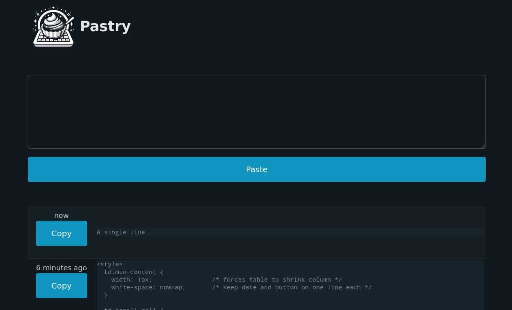

# Pastry

Single user, home network, pastebin server with access both from browsers and the command line with help of `netcat`.

Mostly written during the afternoon of Christmas day 2023 while my children were busy with their new toys.

Features:
  * Can handle text snippets with new lines
  * Access from both the web and command line
  * Text snippets are stored on disk (Usually: `~/.cache/gmelchett/pastry/pastes.gob`)
  * No automatic clean-up of old text snippets




## Installation

You need the go tool chain. I've used go version 1.19, I can imagine that it works with something
older but not anything older than 1.16 since `embed` is used and it is a new feature in 1.16.

Then clone the repo, and run:

`go get && go build`

All data will be embedded into the `pastry` binary. If you want to deploy `pastry` on some other
machine, you can statically built `pastry` with `CGO_ENABLED=0 go build`.

On a systemd you can put the provided `pastry@.service` file in `/usr/lib/systemd/system/` and `pastry` in `/usr/local/bin`.
and run:
```
sudo systemctl enable pastry@$USER
sudo systemctl start pastry@$USER
```


## Usage
`pastry` listens to three ports:
  * 9180 - Web GUI
  * 9181 - For adding new snippets
  * 9182 - For reading old snippets

Terminal usage, best explained with examples:
```
# Push some text to pastry

$ echo "one apple" | nc localhost 9181
$ echo "two apples" | nc localhost 9181
$ echo "three apple" | nc localhost 9181

# Fetch the latest addition:
$ echo get |nc localhost 9182
three apple

# List everything - first column is the index, second relative date, and then the text snippet
$ echo list |nc localhost 9182
#  0    33 seconds ago          one apple
#  1    28 seconds ago          two apples
#  2    23 seconds ago          three apple

# Fetch the snippet with index 2:
$ echo get 2 |nc localhost 9182
three apple

# Fetching snippets with negative index is also possible -1 is the latest, -2 the second latest
$ echo get -1 |nc localhost 9182
three apple

# Drop the latest
$ echo drop |nc localhost 9182
$ echo list |nc localhost 9182
#  0    57 seconds ago          one apple
#  1    52 seconds ago          two apples

# Add a new snippet:
$ echo "two bananas" | nc localhost 9181

# Search all snippets that contains "two" - The second column is the line number.
$ echo grep two | nc localhost 9182
#  1      1     1 minute ago            two apples
#  2      1     15 seconds ago          two bananas

# Sending a full file to pastry
$ cat pastry.go | nc localhost 9181

# and grep for utf8 in pastry. Two hits in entry "3" at line 24 and 71
$ echo grep utf8 | nc localhost 9182
#  3     24     14 seconds ago                  "unicode/utf8"
#  3     71     14 seconds ago                          if utf8.Valid(buf[:n]) {

```

I hope the web GUI is self-explaining :-)


### Command line
I use `nc` (netcat) which is provided by `netcat-traditional` on Debian 12.


## Security
None, bad guys with access could fill your disk, waste CPU cycles, increase your electrical bill and scare your cat.
Don't put `pastry` directly on the internet.


## Privacy
As private as you make it. Anyone with access can read, corrupt and/or delete all text snippets. The data stored on disk is not encrypted.

## Third party packages
 * The CSS framework used https://picocss.com/ (included as zip)
 * http://github.com/spectrumjade/zipfs to embed picocss as zip
 * http://github.com/OpenPeeDeeP/xdg for cache directory.

The `pastry` icon was "created" by https://www.bing.com/images/create


## Future plans
Maybe add some way to remove old snippets from the web?


## License
MIT
